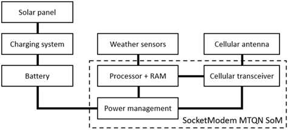

__Modern Computer Architecture and Organization Third Edition__, by Jim Ledin. Published by Packt Publishing.
# Chapter 14, Exercise 2

For the system of [Exercise 1](Ex__1_weather_sys_diagram.md), identify a suitable, commercially available processor and list the reasons why that processor is a good choice for this application. Some factors to weigh are cost, processing speed, tolerance for harsh environments, power consumption, and integrated features such as RAM and communication interfaces.

# Answer
Perform the following steps:
1.	An internet search for _low-power microprocessor_ brings up a selection of processors from manufacturers including STM, Analog Devices, Texas Instruments, Microchip Technology, and several others.
2.	A second search for embedded cellular modem produces a list of cellular modems suitable for this application. Some of these devices are in the form of a **system-on-module (SoM)**, incorporating the RF modem with a programmable processor core in a single module.
3.	The MultiTech SocketModem MTQN SoM (https://multitech.com/product/socketmodem-mtqn-mtqn-mng1-b02-r3-sp/) appears to be suitable for this application. This device is available for US $99.53 and integrates an ARM Cortex-M4 processor for hosting user applications. The SocketModem MTQN provides I/O interfaces, including a serial UART, USB, I2C, SPI, nine analog inputs, and up to 29 digital I/O pins. The Cortex-M4 contains 1 MB of flash memory and 128 KB of RAM.
4.	The SocketModem MTQN documentation states that when transmitting a small amount of data each day, the device can run for years on two AA-size batteries.
5.	The reasons for selecting the SocketModem MTQN for this application are as follows:
* **Cost**: While a price near $US100 is high for a microprocessor board, the integration of the cellular modem accomplishes a key system design goal.
* **Low power consumption**: Depending on the power requirements for the weather sensors, a small solar panel combined with a small rechargeable battery should satisfy system power requirements for several years.
* **Environmental compatibility**: The temperature range specification for the SoM is -40° to +85°C (-40° to +185°F), which supports operation anywhere in the world. The relative humidity tolerance range (20% to 90% RH, non-condensing) may require installation in a weatherproof enclosure.
* **Processing power**: The SoM contains an STM32L471QG 32-bit ARM processor operating at 80 MHz. This processor offers substantial capability, including an FPU and dynamic voltage scaling. It is possible to perform extensive preprocessing (filtering, sensor fault detection, and so on) on sensor measurements before data transmission. The flash and RAM within the device should be more than adequate for the application.
* **Certified solution**: The SocketModem MTQN is certified by the FCC and wireless carriers for use on cellular networks.
* **Development support**: Free development tools and online resources are available at https://multitech.com/product/socketmodem-developer-kit/.
6.	The dashed box in the following diagram indicates the portion of the system implemented by the SocketModem MTQN SoM:

